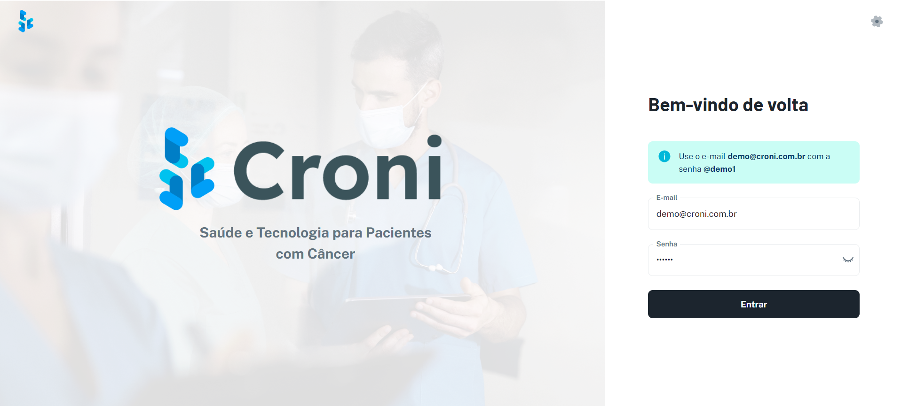

# Plataforma Croni

## Links de Acesso

- **Ambiente de Demonstração:** [https://croni-three.vercel.app](https://croni-three.vercel.app)


## Installation

**Variáveis de ambiente**
- Altere ad variáveis de ambiente
```sh
NEXT_PUBLIC_SERVER_URL=
NEXT_PUBLIC_ASSET_URL=
API_KEY_GOOGLE=
```

**Using Yarn (Recommended)**

```sh
yarn install
yarn dev
```
## Tecnologia

A Plataforma Croni é desenvolvida utilizando as seguintes tecnologias:

- **Frontend:**
  - **Nextjs:** Utilizado para construção da interface do usuário, proporcionando uma experiência interativa e responsiva.
  - **Material UI:** Para estilização dos componentes, permitindo a criação de interfaces modernas e atraentes.

- **Estratégia de Mock:**
  - Durante a fase inicial do MVP (Produto Mínimo Viável), utilizamos dados mockados para simular o comportamento real da aplicação. Isso nos permitiu desenvolver e testar funcionalidades sem a necessidade de integração imediata com sistemas externos.

## Equipe

A Plataforma Croni é desenvolvida por uma equipe dedicada de profissionais:

- **Tony Desideri:** Desenvolvedor full-stack
- **Lorena Silva:** Design Web
- **Fernanda Maciel:** Desenvolvedora full-stack
- **Valéria Almeida:** Enfermeira
- **Walessa Almeida:** Psicóloga

## Problema

O tratamento de pacientes com câncer é complexo e envolve o gerenciamento de um grande volume de informações, incluindo exames e medicações. Muitas vezes, isso resulta em falhas no processo e falta de informações cruciais para os médicos. Quanto mais precisas forem as informações fornecidas sobre o paciente, melhor será a condução do tratamento.

## Solução

A Plataforma Croni foi idealizada para apoiar pacientes com câncer, utilizando a tecnologia a seu favor. A solução proposta inclui:

- **Integração com prontuários eletrônicos existentes:** Facilita a gestão das informações dos pacientes.
- **Ferramentas de IA:** Auxilia pacientes na compreensão e gestão de seus tratamentos.
- **Dashboards detalhados:** Fornece aos médicos um histórico completo dos pacientes e visualizações de dados importantes.
- **Gestão de protocolos e sintomas:** Organiza o fluxo de tratamento e monitora a resposta do paciente.
- **Calendário e lembretes:** Integra com plataformas como Google Calendar para ajudar os pacientes a gerenciar suas datas e tratamentos.
- **Educação e suporte:** Oferece vídeos educativos, chat com IA e comunicação direta com o serviço de saúde especializado.
- **Comunidade:** Oferece uma rede de apoio aos pacientes.

- **Acompanhamento e Dashboard:** Fornece um detalhamento completo do tratamento dos pacientes. Contando com dashboards e fluxos de tratamento detalhados, além de ferramentas de IA, permite que o médico faça perguntas específicas sobre o paciente e obtenha respostas precisas e atualizadas.

Através dessas funcionalidades, a Plataforma Croni garante maior precisão no tratamento de pessoas com câncer, melhorando a comunicação e a gestão de informações entre pacientes e médicos.
